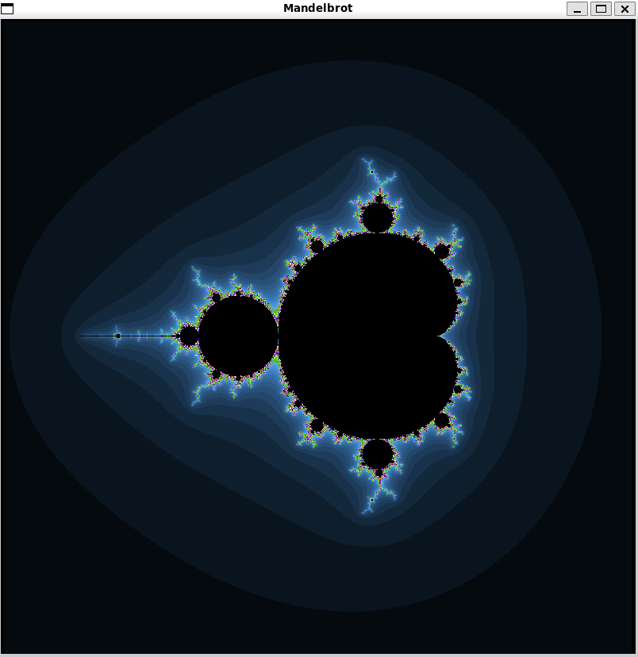
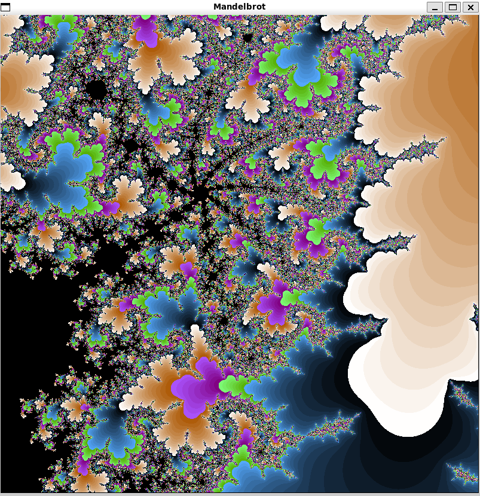

# Отрисовка множества Мандельброта при помощи разных способов оптимизации алгоритма

# Компиляция
Для компиляции оспользуется makefile. Для запуска разных версий оптимизации используются аругемента командной строки.
Для запуска: ./build/mandelbrot.out ....(вместо многоточия аргумента соответвенно с таблицей).

Аргумент | Версия
:-------:|:------
simple   | классический метод с обработкой каждой точки
array    | оптимизация посредством обработки массива по 4 элемента
simd     | использование векторных инструкций

# Приближение и отдаление изображения
пргорамма поддеживает возможность зума для этого после запуска программы используются клавиши:

Клавиша|Действие
:-----:|:-------
 ↑  | Сдвиг вверх
 ↓  | Сдвиг вниз
 ←  | Сдвиг влево
 →  | Сдвиг вправо
 W  | Увеличение изображения
 S  | Уменьшение изображения
 R  | Сброс зума

# Теоретическая справка

Множество Мандельброта — множество точек C на комплексной плоскости, для которых рекуррентное соотношение $z_i = z_{i-1}^2 + z_0$ при $z_0 = 0$ задаёт ограниченную последовательность.

На данной картинке вы можете видеть отрисованное множество мандельброта на компелксной плоскости, где цвет точки определяется колличеством итераций цикла, другими словами начиная с какого $i$ точка выходит за пределы фиксированного круга.

При приблжении можно увидеить фрактлы и доказательсво того, что это множество (закрашенное в черный цвет) имеет бесконечную длину.

# Разные виды оптимизации

В программе используется два вида оптимизации: использование массивов по 4 элемента и векторных simd интсрукций.

Также для оптимизации используется флаг -О3.

Для оценки времени работы алгоритма испооьзуется команде _rdtsc(), возращающая число тиков процессора с момента запуска компьютера.

В таблице приведены данные по колличест ву тиков для каждой из версий.

Уровень оптимизации |Simple | Array | SIMD |
------------------------------------|-------|-------|------|
`-O0`                               | 234853959 | 434327074 | 206668371 |
`-O3`                               | 135899593 |  65287199 | 54996485 |

Данная таблица наглядно отражает что использование методов оптимизации заметно повышает производительность что влияет на колличесво кадров в секунду (fps).

# Вывод

В результате изучения способов оптимизации алгоритма вычисления Множества Мандельброта был сделан вывод, что использование векторных инструкций с флагом оптимизации -O3 способствует максимальнойй производительсноти.
